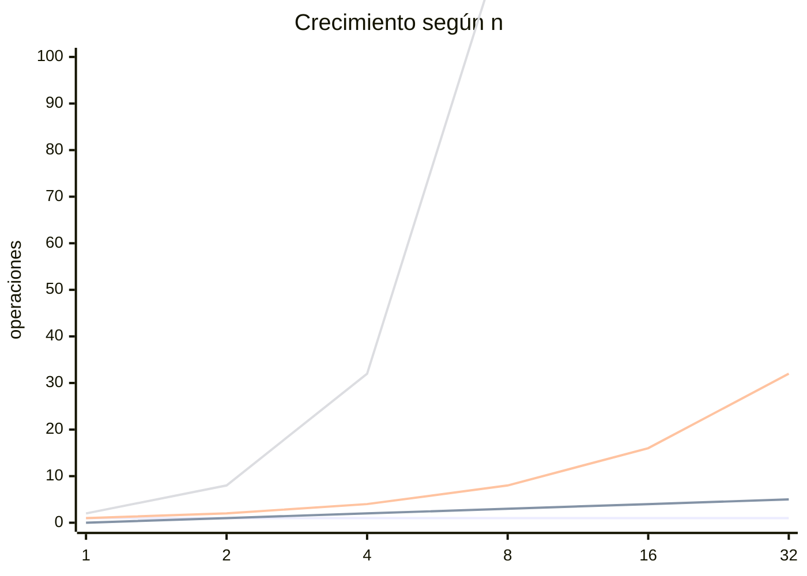

## 3. Complejidad Algorítmica

## Índice
- [3. Complejidad Algorítmica](#3-complejidad-algorítmica)
- [Índice](#índice)
  - [Notación Big O](#notación-big-o)
  - [Complejidad Temporal](#complejidad-temporal)
  - [Complejidad Espacial](#complejidad-espacial)
  - [Jerarquía de complejidades](#jerarquía-de-complejidades)
  - [Gráfica de crecimiento](#gráfica-de-crecimiento)
  - [Gráfica de crecimiento](#gráfica-de-crecimiento-1)

---

La complejidad algorítmica mide **cuánto crece el costo** de un algoritmo
(tiempo o memoria) a medida que crece el tamaño de la entrada `n`.

---

### Notación Big O

Expresa el **peor caso**: ¿qué tan mal se puede poner el algoritmo?  
Se escribe como `O(f(n))` y se lee "orden de f de n".

Reglas para calcularla:
- Se ignoran las constantes → `O(2n)` = `O(n)`
- Se queda solo el término dominante → `O(n² + n)` = `O(n²)`

---

### Complejidad Temporal

Mide **cuántas operaciones** ejecuta el algoritmo según `n`.
```cpp
// O(1) — siempre hace lo mismo sin importar n
int primero(int arr[]) {
    return arr[0];
}

// O(n) — recorre todos los elementos
for (int i = 0; i < n; i++) { ... }

// O(n²) — bucle dentro de bucle
for (int i = 0; i < n; i++)
    for (int j = 0; j < n; j++) { ... }

// O(log n) — divide el problema a la mitad cada vez (ej: búsqueda binaria)
int mid = (low + high) / 2;
```

---

### Complejidad Espacial

Mide **cuánta memoria extra** usa el algoritmo según `n`.
```cpp
// O(1) — usa memoria fija sin importar n
int suma = 0;
for (int i = 0; i < n; i++) suma += arr[i];

// O(n) — crea una estructura proporcional a n
vector<int> copia(arr, arr + n);

// O(n) — recursión con n llamadas en el call stack
void f(int n) {
    if (n == 0) return;
    f(n - 1);
}
```

> Tiempo y espacio suelen ser un **trade-off**: puedes usar más memoria
> para ahorrar tiempo (memoización) o más tiempo para ahorrar memoria.

---

### Jerarquía de complejidades

De mejor a peor rendimiento:

| Big O | Nombre | Ejemplo típico |
|---|---|---|
| `O(1)` | Constante | Acceso a array por índice |
| `O(log n)` | Logarítmica | Búsqueda binaria |
| `O(n)` | Lineal | Recorrer un arreglo |
| `O(n log n)` | Linealítmica | MergeSort, QuickSort |
| `O(n²)` | Cuadrática | Bubble Sort, bucle doble |
| `O(2ⁿ)` | Exponencial | Fibonacci recursivo |
| `O(n!)` | Factorial | Permutaciones |

---

### Gráfica de crecimiento
### Gráfica de crecimiento


> De abajo hacia arriba: O(1), O(log n), O(n), O(n²)
> A partir de O(n²) el costo crece demasiado rápido para ser práctico.