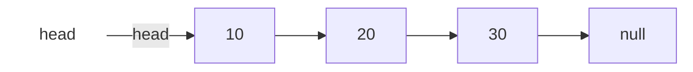
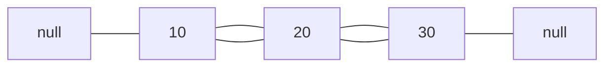
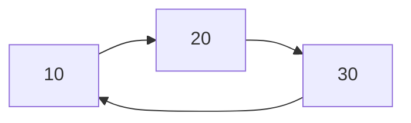

## 4. Listas Enlazadas

## Índice
- [4. Listas Enlazadas](#4-listas-enlazadas)
- [Índice](#índice)
  - [El Nodo](#el-nodo)
  - [Lista Simple](#lista-simple)
  - [Lista Doble](#lista-doble)
  - [Lista Circular](#lista-circular)
  - [Comparación](#comparación)
  - [¿Cuándo usar cada una?](#cuándo-usar-cada-una)

---

Una **lista enlazada** es una estructura de datos donde cada elemento
apunta al siguiente mediante punteros. A diferencia de un arreglo,
sus elementos **no están contiguos en memoria**.

---

### El Nodo

Es la unidad básica de cualquier lista enlazada.
Contiene un **dato** y uno o más **punteros** a otros nodos.
```cpp
struct Nodo {
    int dato;
    Nodo* siguiente;  // puntero al próximo nodo

    Nodo(int val) : dato(val), siguiente(nullptr) {}
};
```
```
┌─────────────────┐
│  dato           │  ← valor almacenado
│  *siguiente ────┼──→ (próximo nodo o nullptr)
└─────────────────┘
```

---

### Lista Simple

Cada nodo apunta **solo al siguiente**. El último apunta a `nullptr`.

```cpp
struct ListaSimple {
    Nodo* head = nullptr;

    // Insertar al inicio → O(1)
    void insertar(int val) {
        Nodo* nuevo = new Nodo(val);
        nuevo->siguiente = head;
        head = nuevo;
    }

    // Buscar → O(n)
    bool buscar(int val) {
        Nodo* actual = head;
        while (actual != nullptr) {
            if (actual->dato == val) return true;
            actual = actual->siguiente;
        }
        return false;
    }

    // Eliminar por valor → O(n)
    void eliminar(int val) {
        if (!head) return;
        if (head->dato == val) { head = head->siguiente; return; }
        Nodo* actual = head;
        while (actual->siguiente && actual->siguiente->dato != val)
            actual = actual->siguiente;
        if (actual->siguiente)
            actual->siguiente = actual->siguiente->siguiente;
    }
};
```

---

### Lista Doble

Cada nodo apunta al **siguiente y al anterior**.
Permite recorrer en ambas direcciones.


```cpp
struct NodoDoble {
    int dato;
    NodoDoble* siguiente;
    NodoDoble* anterior;

    NodoDoble(int val) : dato(val), siguiente(nullptr), anterior(nullptr) {}
};
```
```cpp
// Insertar al final → O(1) si se mantiene puntero tail
void insertarFinal(int val) {
    NodoDoble* nuevo = new NodoDoble(val);
    if (!head) { head = tail = nuevo; return; }
    nuevo->anterior = tail;
    tail->siguiente = nuevo;
    tail = nuevo;
}

// Eliminar un nodo → O(1) si ya tienes el puntero al nodo
void eliminar(NodoDoble* nodo) {
    if (nodo->anterior) nodo->anterior->siguiente = nodo->siguiente;
    else head = nodo->siguiente;
    if (nodo->siguiente) nodo->siguiente->anterior = nodo->anterior;
    else tail = nodo->anterior;
    delete nodo;
}
```

---

### Lista Circular

El último nodo apunta de vuelta al **primero** (simple o doble).
No existe `nullptr` — la lista no tiene fin.


```cpp
// Insertar al final manteniendo circularidad
void insertarFinal(int val) {
    Nodo* nuevo = new Nodo(val);
    if (!head) { head = nuevo; nuevo->siguiente = head; return; }
    Nodo* actual = head;
    while (actual->siguiente != head)
        actual = actual->siguiente;
    actual->siguiente = nuevo;
    nuevo->siguiente = head;
}

// ⚠️ Al recorrer, condición de parada es volver al head
void imprimir() {
    if (!head) return;
    Nodo* actual = head;
    do {
        cout << actual->dato << " ";
        actual = actual->siguiente;
    } while (actual != head);
}
```

---

### Comparación

| | Simple | Doble | Circular |
|---|---|---|---|
| Dirección de recorrido | → | ← → | → (sin fin) |
| Memoria por nodo | 1 puntero | 2 punteros | 1 puntero |
| Insertar al inicio | O(1) | O(1) | O(1) |
| Insertar al final | O(n) | O(1) con `tail` | O(n) |
| Eliminar nodo conocido | O(n) | O(1) | O(n) |
| Buscar | O(n) | O(n) | O(n) |

---

### ¿Cuándo usar cada una?

| Tipo | Úsala cuando... |
|---|---|
| **Simple** | Solo necesitas recorrer en un sentido y la memoria importa |
| **Doble** | Necesitas recorrer en ambos sentidos o eliminar nodos eficientemente (ej: historial, undo/redo) |
| **Circular** | Los elementos se procesan en ciclos repetidos (ej: turno de jugadores, buffer de audio) |