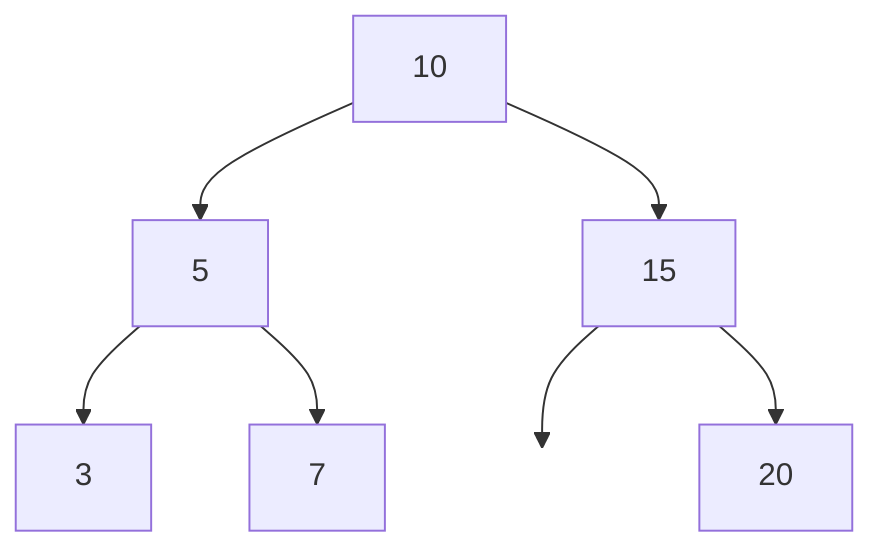
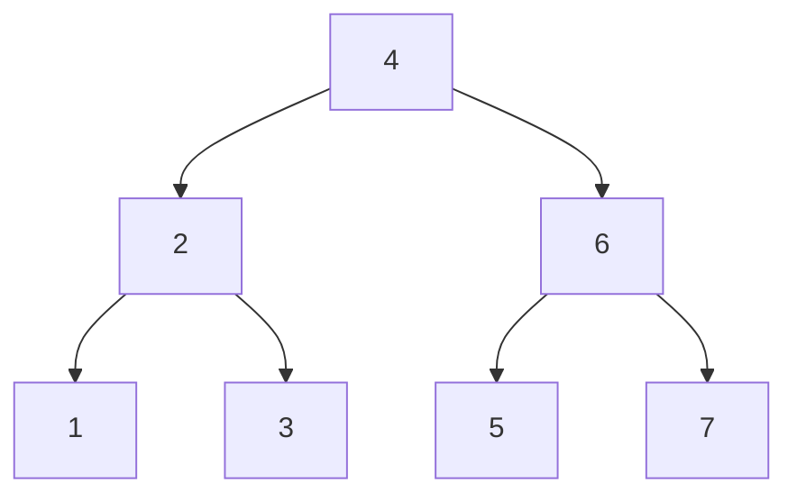

## 6. Árboles Binarios

## Índice
- [6. Árboles Binarios](#6-árboles-binarios)
- [Índice](#índice)
  - [Terminología](#terminología)
  - [BST — Binary Search Tree](#bst--binary-search-tree)
  - [Recorridos](#recorridos)
    - [Inorder — izquierda → raíz → derecha](#inorder--izquierda--raíz--derecha)
    - [Preorder — raíz → izquierda → derecha](#preorder--raíz--izquierda--derecha)
    - [Postorder — izquierda → derecha → raíz](#postorder--izquierda--derecha--raíz)
  - [Complejidad de operaciones](#complejidad-de-operaciones)

---

Un **árbol binario** es una estructura jerárquica donde cada nodo
tiene **a lo sumo dos hijos**: izquierdo y derecho.

---

### Terminología
```
              10          ← raíz (root): nodo sin padre
             /  \
            5    15       ← nivel 1
           / \     \
          3   7     20    ← nivel 2 / hojas (sin hijos)
```

| Término | Descripción |
|---|---|
| **Raíz** | Nodo superior, sin padre |
| **Hoja** | Nodo sin hijos |
| **Altura** | Cantidad de niveles del árbol (aquí: 3) |
| **Nivel** | Distancia desde la raíz (raíz = nivel 0) |
| **Subárbol** | Cualquier nodo con sus descendientes |
| **Padre / Hijo** | Relación directa entre nodos conectados |
```cpp
struct Nodo {
    int dato;
    Nodo* izq;
    Nodo* der;

    Nodo(int val) : dato(val), izq(nullptr), der(nullptr) {}
};
```

---

### BST — Binary Search Tree

Un árbol binario de búsqueda cumple siempre esta propiedad:
```
    valor izquierdo < nodo < valor derecho
```


- Todo lo que está a la **izquierda** de un nodo es **menor**
- Todo lo que está a la **derecha** es **mayor**
- Esto permite búsquedas eficientes sin recorrer todo el árbol
```cpp
// Insertar → O(log n) promedio
Nodo* insertar(Nodo* raiz, int val) {
    if (!raiz) return new Nodo(val);
    if (val < raiz->dato)
        raiz->izq = insertar(raiz->izq, val);
    else if (val > raiz->dato)
        raiz->der = insertar(raiz->der, val);
    return raiz;
}

// Buscar → O(log n) promedio
bool buscar(Nodo* raiz, int val) {
    if (!raiz) return false;
    if (raiz->dato == val) return true;
    if (val < raiz->dato) return buscar(raiz->izq, val);
    return buscar(raiz->der, val);
}
```

---

### Recorridos

El orden en que se visitan los nodos cambia según el recorrido.
Usando el mismo árbol de ejemplo:

> Inorder: 1 2 3 4 5 6 7
> Preorder: 4 2 1 3 6 5 7
> Postorder: 1 3 2 5 7 6 4

#### Inorder — izquierda → raíz → derecha
Produce los valores **ordenados de menor a mayor**.
```cpp
void inorder(Nodo* n) {
    if (!n) return;
    inorder(n->izq);
    cout << n->dato << " ";
    inorder(n->der);
}
// salida: 1 2 3 4 5 6 7
```

#### Preorder — raíz → izquierda → derecha
Útil para **copiar o serializar** el árbol.
```cpp
void preorder(Nodo* n) {
    if (!n) return;
    cout << n->dato << " ";
    preorder(n->izq);
    preorder(n->der);
}
// salida: 4 2 1 3 6 5 7
```

#### Postorder — izquierda → derecha → raíz
Útil para **eliminar** el árbol (borra hijos antes que el padre).
```cpp
void postorder(Nodo* n) {
    if (!n) return;
    postorder(n->izq);
    postorder(n->der);
    cout << n->dato << " ";
}
// salida: 1 3 2 5 7 6 4
```

---

### Complejidad de operaciones

| Operación | Promedio | Peor caso (árbol degenerado) |
|---|---|---|
| Insertar | O(log n) | O(n) |
| Buscar | O(log n) | O(n) |
| Eliminar | O(log n) | O(n) |
| Recorrer | O(n) | O(n) |

> El **peor caso O(n)** ocurre cuando el árbol se desbalancea y se
> convierte en una lista enlazada (todos los nodos hacia un solo lado).
> Los árboles AVL resuelven este problema manteniéndose balanceados.