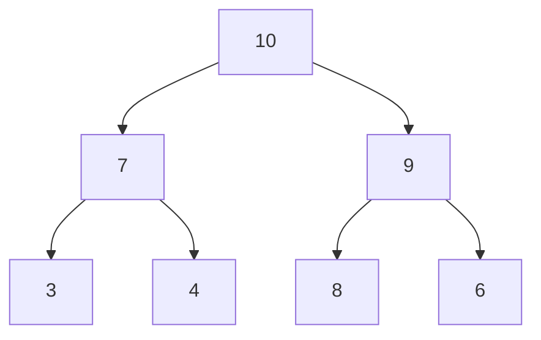
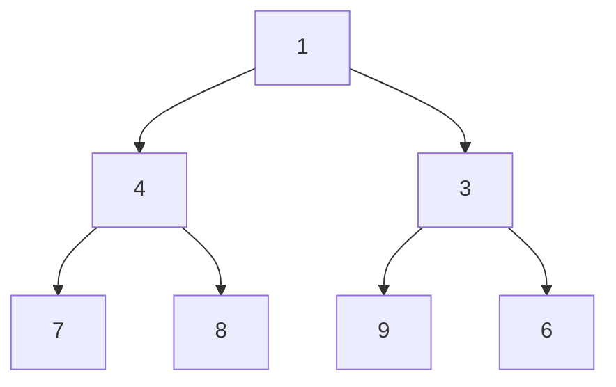

## 8. Heap & HeapSort

## Índice
- [8. Heap \& HeapSort](#8-heap--heapsort)
- [Índice](#índice)
  - [Árbol completo → Arreglo](#árbol-completo--arreglo)
  - [Max-Heap](#max-heap)
  - [Min-Heap](#min-heap)
  - [Heapify](#heapify)
  - [HeapSort paso a paso](#heapsort-paso-a-paso)
    - [Fase 1 — Construir el max-heap](#fase-1--construir-el-max-heap)
    - [Fase 2 — Extracciones sucesivas](#fase-2--extracciones-sucesivas)
  - [Complejidad](#complejidad)

---

Un **heap** es un árbol binario **completo** que cumple la propiedad
de orden entre padre e hijo. Se representa internamente como un arreglo.

---

### Árbol completo → Arreglo

Todo heap se almacena en un arreglo aprovechando esta relación de índices:
```
Índice padre:        i
Hijo izquierdo:      2i + 1
Hijo derecho:        2i + 2
```
```
Árbol:               Arreglo:
        10           [10, 7, 9, 3, 4, 8, 6]
       /  \           0   1  2  3  4  5  6
      7    9
     / \  / \
    3  4  8  6
```

---

### Max-Heap

El padre **siempre es mayor** que sus hijos.
La raíz contiene el **valor máximo**.


---

### Min-Heap

El padre **siempre es menor** que sus hijos.
La raíz contiene el **valor mínimo**.


---

### Heapify

**Heapify** es la operación que restaura la propiedad del heap
cuando un nodo viola el orden con sus hijos. Se aplica de abajo hacia arriba.

**Ejemplo:** arreglo desordenado `[3, 10, 7, 4, 9]` → construir max-heap

**Paso 1 — estado inicial:**
```
        3
       / \
      10   7
     / \
    4   9
```
El nodo `3` viola la propiedad: sus hijos son mayores.

**Paso 2 — heapify sobre nodo 3 (índice 0):**
El mayor hijo es `10` (índice 1). Se intercambia `3` ↔ `10`:
```
        10
       /  \
      3    7
     / \
    4   9
```
El `3` bajó pero aún viola la propiedad (hijo `9` es mayor).

**Paso 3 — heapify continúa sobre nodo 3 (índice 1):**
Se intercambia `3` ↔ `9`:
```
        10
       /  \
      9    7
     / \
    4   3
```
✅ Max-heap restaurado. Ningún padre es menor que sus hijos.

---

### HeapSort paso a paso

HeapSort ordena un arreglo en dos fases:
1. **Construir** un max-heap desde el arreglo
2. **Extraer** la raíz repetidamente y reconstruir el heap

**Arreglo inicial:** `[4, 10, 3, 5, 1]`

---

#### Fase 1 — Construir el max-heap

Se aplica heapify desde el último nodo no-hoja hacia la raíz:
```
Estado inicial:
        4
       / \
      10   3
     / \
    5   1

Heapify desde índice 1 (nodo 10):
10 > 5 y 10 > 1 → ya cumple ✅

Heapify desde índice 0 (nodo 4):
Mayor hijo es 10 → intercambiar 4 ↔ 10:

        10
       /  \
      4    3
     / \
    5   1

Heapify sobre 4 (bajó a índice 1):
Mayor hijo es 5 → intercambiar 4 ↔ 5:

        10
       /  \
      5    3
     / \
    4   1
```
✅ Max-heap listo: `[10, 5, 3, 4, 1]`

---

#### Fase 2 — Extracciones sucesivas

En cada paso: **mover la raíz al final** del arreglo activo,
reducir el tamaño del heap en 1, y aplicar heapify a la nueva raíz.

**Extracción 1:** intercambiar raíz `10` con el último elemento `1`:
```
        1               Heap activo: [1, 5, 3, 4] | Ordenado: [10]
       / \
      5   3
     /
    4

Heapify sobre 1:
Mayor hijo es 5 → 1 ↔ 5:

        5
       / \
      1   3
     /
    4

Mayor hijo de 1 es 4 → 1 ↔ 4:

        5
       / \
      4   3
     /
    1
```
Heap activo: `[5, 4, 3, 1]` | Ordenado: `[10]`

---

**Extracción 2:** intercambiar raíz `5` con `1`:
```
        1               Heap activo: [1, 4, 3] | Ordenado: [5, 10]
       / \
      4   3

Heapify sobre 1:
Mayor hijo es 4 → 1 ↔ 4:

        4
       / \
      1   3
```
Heap activo: `[4, 1, 3]` | Ordenado: `[5, 10]`

---

**Extracción 3:** intercambiar raíz `4` con `3`:
```
        3               Heap activo: [3, 1] | Ordenado: [4, 5, 10]
       /
      1

Heapify sobre 3:
3 > 1 → ya cumple ✅
```

---

**Extracción 4:** intercambiar raíz `3` con `1`:
```
Heap activo: [1] | Ordenado: [3, 4, 5, 10]
```

---

**Resultado final:** `[1, 3, 4, 5, 10]` ✅
```
Paso a paso del arreglo:
[4,  10, 3,  5,  1 ]   ← inicial
[10,  5, 3,  4,  1 ]   ← max-heap construido
[5,   4, 3,  1, |10]   ← extracción 1
[4,   1, 3, |5,  10]   ← extracción 2
[3,   1, |4,  5,  10]  ← extracción 3
[1,  |3,  4,  5,  10]  ← extracción 4
[1,   3,  4,  5,  10]  ← ordenado ✅
```

---

### Complejidad

| Operación | Complejidad |
|---|---|
| Construir heap | O(n) |
| Insertar | O(log n) |
| Eliminar raíz | O(log n) |
| Heapify | O(log n) |
| HeapSort completo | O(n log n) |
| Espacio (HeapSort) | O(1) — ordena en el mismo arreglo |

> HeapSort tiene la ventaja de ser O(n log n) garantizado en todos los
> casos, a diferencia de QuickSort que puede degradar a O(n²).