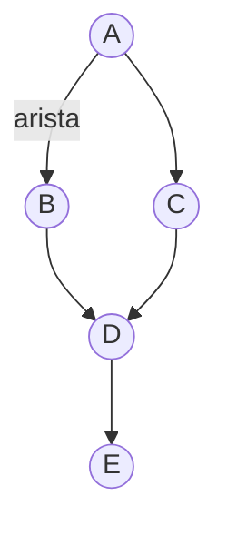
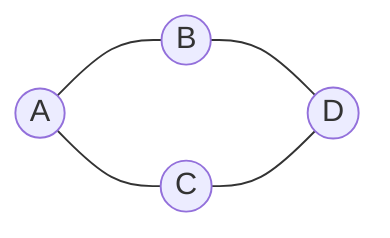
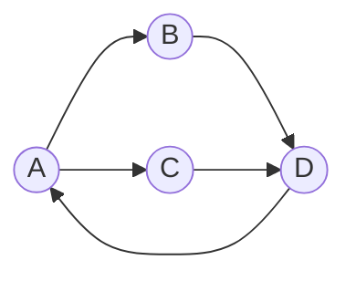
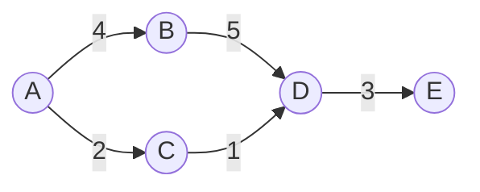
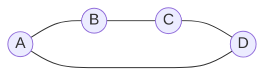
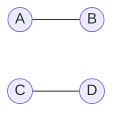
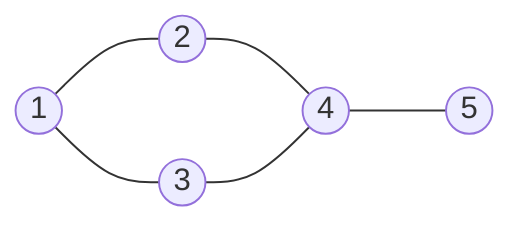
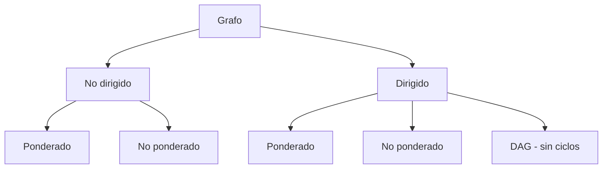

## 10. Grafos

## Índice
- [10. Grafos](#10-grafos)
- [Índice](#índice)
  - [Terminología](#terminología)
  - [Tipos de Grafos](#tipos-de-grafos)
    - [No dirigido](#no-dirigido)
    - [Dirigido (Dígrafo)](#dirigido-dígrafo)
    - [Ponderado](#ponderado)
    - [Conexo vs No Conexo](#conexo-vs-no-conexo)
  - [Formas de Representación](#formas-de-representación)
    - [Matriz de Adyacencia](#matriz-de-adyacencia)
    - [Lista de Adyacencia](#lista-de-adyacencia)
  - [¿Cuándo usar cada representación?](#cuándo-usar-cada-representación)
  - [Resumen visual de tipos](#resumen-visual-de-tipos)

---

Un **grafo** es una estructura compuesta por **vértices** (nodos) conectados
por **aristas** (edges). A diferencia de los árboles, no tienen una jerarquía
fija ni necesariamente una raíz.

---

### Terminología


| Término | Descripción |
|---|---|
| **Vértice** | Nodo del grafo (A, B, C...) |
| **Arista** | Conexión entre dos vértices |
| **Grado** | Cantidad de aristas que tiene un vértice |
| **Camino** | Secuencia de vértices conectados por aristas |
| **Ciclo** | Camino que empieza y termina en el mismo vértice |
| **Peso** | Valor asociado a una arista (distancia, costo, etc.) |

---

### Tipos de Grafos

#### No dirigido
Las aristas **no tienen dirección** — la conexión es bidireccional.

> Si existe arista A → B, también existe B → A.

---

#### Dirigido (Dígrafo)
Las aristas **tienen dirección** — solo se puede ir en un sentido.

> La arista A → B no implica que exista B → A.

---

#### Ponderado
Las aristas tienen un **peso o costo** asociado.

> Usado en problemas de camino mínimo (Dijkstra, Bellman-Ford).

---

#### Conexo vs No Conexo

**Conexo:** existe un camino entre **cualquier par** de vértices.


**No conexo:** hay vértices o grupos **aislados** sin camino entre sí.

> A y B no tienen camino hacia C y D.

---

### Formas de Representación

Dado el siguiente grafo de ejemplo:


#### Matriz de Adyacencia
Matriz `n×n` donde `M[i][j] = 1` si existe arista entre `i` y `j`.
```
   1  2  3  4  5
1 [0, 1, 1, 0, 0]
2 [1, 0, 0, 1, 0]
3 [1, 0, 0, 1, 0]
4 [0, 1, 1, 0, 1]
5 [0, 0, 0, 1, 0]
```

✅ Consultar si existe arista → O(1)
❌ Espacio → O(n²) — costoso en grafos grandes y dispersos
```cpp
int matriz[5][5] = {
    {0, 1, 1, 0, 0},
    {1, 0, 0, 1, 0},
    {1, 0, 0, 1, 0},
    {0, 1, 1, 0, 1},
    {0, 0, 0, 1, 0}
};
```

---

#### Lista de Adyacencia
Cada vértice guarda una lista de sus vecinos directos.
```
1 → [2, 3]
2 → [1, 4]
3 → [1, 4]
4 → [2, 3, 5]
5 → [4]
```

✅ Espacio → O(n + e) donde `e` = cantidad de aristas
✅ Más eficiente para grafos dispersos
❌ Consultar si existe arista → O(grado del vértice)
```cpp
vector<vector<int>> lista = {
    {},        // índice 0 vacío
    {2, 3},    // vértice 1
    {1, 4},    // vértice 2
    {1, 4},    // vértice 3
    {2, 3, 5}, // vértice 4
    {4}        // vértice 5
};
```

---

### ¿Cuándo usar cada representación?

| | Matriz de Adyacencia | Lista de Adyacencia |
|---|---|---|
| Grafo denso (muchas aristas) | ✅ | ❌ |
| Grafo disperso (pocas aristas) | ❌ | ✅ |
| Consultar arista u-v | O(1) | O(grado) |
| Recorrer vecinos de un vértice | O(n) | O(grado) |
| Espacio | O(n²) | O(n + e) |
| Implementar Dijkstra/BFS/DFS | Funciona | Preferido |

---

### Resumen visual de tipos
