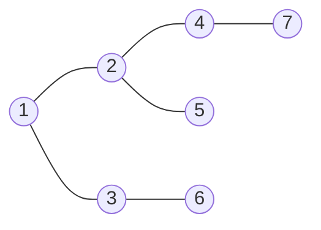
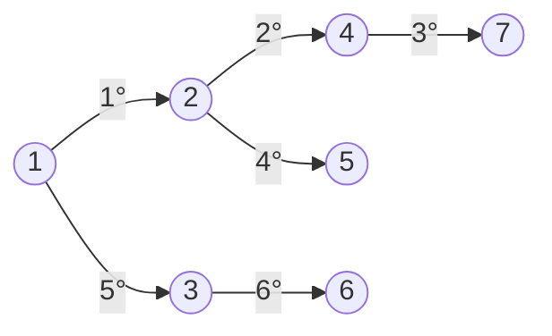
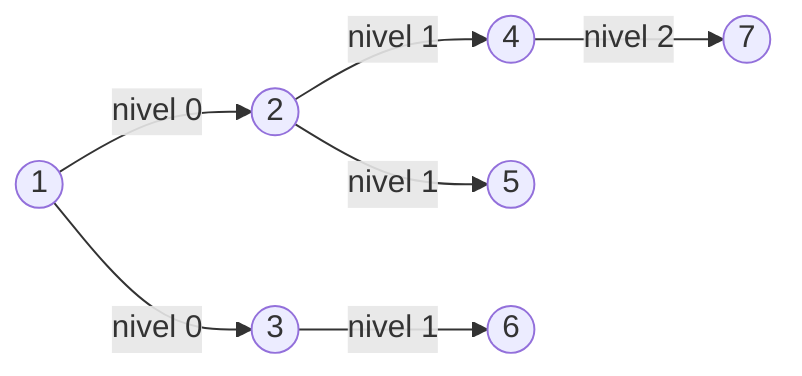
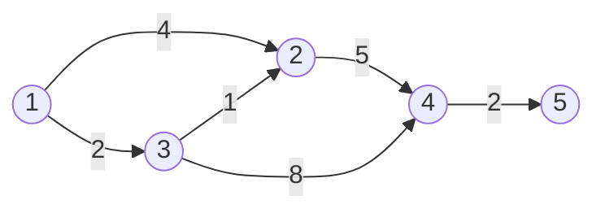

## 11. Algoritmos en Grafos

## Índice
- [11. Algoritmos en Grafos](#11-algoritmos-en-grafos)
- [Índice](#índice)
  - [DFS — Depth First Search](#dfs--depth-first-search)
  - [BFS — Breadth First Search](#bfs--breadth-first-search)
  - [Dijkstra](#dijkstra)
  - [¿Cuándo usar DFS vs BFS?](#cuándo-usar-dfs-vs-bfs)
  - [Complejidad](#complejidad)
  - [Tabla comparativa final](#tabla-comparativa-final)

---

Grafo de ejemplo usado en los tres algoritmos:

```cpp
vector<vector<int>> grafo = {
    {},           // 0 vacío
    {2, 3},       // 1
    {1, 4, 5},    // 2
    {1, 6},       // 3
    {2, 7},       // 4
    {2},          // 5
    {3},          // 6
    {4}           // 7
};
```

---

### DFS — Depth First Search

Recorre el grafo yendo **tan profundo como sea posible** antes de
retroceder. Usa un **stack** (implícito en la recursión).

**Estrategia:** entrar, marcar, ir al primer vecino no visitado,
retroceder cuando no hay más vecinos.
```
Desde vértice 1:
1 → 2 → 4 → 7 → (retrocede) → 5 → (retrocede) → (retrocede) → 3 → 6

Orden de visita: 1, 2, 4, 7, 5, 3, 6
```

```cpp
void dfs(vector<vector<int>>& g, vector<bool>& visitado, int v) {
    visitado[v] = true;
    cout << v << " ";

    for (int vecino : g[v]) {
        if (!visitado[vecino])
            dfs(g, visitado, vecino);
    }
}

// Llamada inicial
vector<bool> visitado(8, false);
dfs(grafo, visitado, 1);
// salida: 1 2 4 7 5 3 6
```

---

### BFS — Breadth First Search

Recorre el grafo **nivel por nivel**, visitando primero todos los
vecinos del nodo actual antes de ir más profundo. Usa una **queue**.

**Estrategia:** encolar el nodo inicial, visitar todos sus vecinos,
encolar sus vecinos, repetir.
```
Desde vértice 1:
Nivel 0: 1
Nivel 1: 2, 3        (vecinos de 1)
Nivel 2: 4, 5, 6     (vecinos de 2 y 3)
Nivel 3: 7           (vecino de 4)

Orden de visita: 1, 2, 3, 4, 5, 6, 7
```

```cpp
void bfs(vector<vector<int>>& g, int inicio) {
    vector<bool> visitado(g.size(), false);
    queue<int> q;

    visitado[inicio] = true;
    q.push(inicio);

    while (!q.empty()) {
        int v = q.front();
        q.pop();
        cout << v << " ";

        for (int vecino : g[v]) {
            if (!visitado[vecino]) {
                visitado[vecino] = true;
                q.push(vecino);
            }
        }
    }
}

// Llamada inicial
bfs(grafo, 1);
// salida: 1 2 3 4 5 6 7
```

---

### Dijkstra

Encuentra el **camino más corto** desde un vértice origen hacia todos
los demás en un grafo **ponderado sin pesos negativos**.

**Estrategia:** siempre expandir el vértice no visitado con
**menor distancia acumulada** usando una cola de prioridad (min-heap).

Grafo ponderado de ejemplo:

```
Desde vértice 1, distancias iniciales:
dist = [∞, 0, ∞, ∞, ∞, ∞]

Paso 1: expandir 1 (dist=0)
        → dist[2] = 4, dist[3] = 2
        dist = [∞, 0, 4, 2, ∞, ∞]

Paso 2: expandir 3 (dist=2, el menor)
        → dist[2] = min(4, 2+1) = 3  ← se actualiza
        → dist[4] = 2+8 = 10
        dist = [∞, 0, 3, 2, 10, ∞]

Paso 3: expandir 2 (dist=3)
        → dist[4] = min(10, 3+5) = 8 ← se actualiza
        dist = [∞, 0, 3, 2, 8, ∞]

Paso 4: expandir 4 (dist=8)
        → dist[5] = 8+2 = 10
        dist = [∞, 0, 3, 2, 8, 10]

Resultado: caminos mínimos desde 1:
  1→2: 3  (1→3→2)
  1→3: 2  (1→3)
  1→4: 8  (1→3→2→4)
  1→5: 10 (1→3→2→4→5)
```
```cpp
#include <queue>

void dijkstra(vector<vector<pair<int,int>>>& g, int origen) {
    int n = g.size();
    vector<int> dist(n, INT_MAX);
    priority_queue<pair<int,int>,
                   vector<pair<int,int>>,
                   greater<>> pq;   // min-heap

    dist[origen] = 0;
    pq.push({0, origen});           // {distancia, vértice}

    while (!pq.empty()) {
        auto [d, v] = pq.top();
        pq.pop();

        if (d > dist[v]) continue;  // ya fue procesado con menor dist

        for (auto [peso, vecino] : g[v]) {
            if (dist[v] + peso < dist[vecino]) {
                dist[vecino] = dist[v] + peso;
                pq.push({dist[vecino], vecino});
            }
        }
    }

    for (int i = 1; i < n; i++)
        cout << "dist[" << i << "] = " << dist[i] << "\n";
}
```

---

### ¿Cuándo usar DFS vs BFS?

| Situación | Algoritmo |
|---|---|
| Detectar ciclos en un grafo | DFS |
| Verificar si un grafo es conexo | DFS o BFS |
| Encontrar camino más corto (sin pesos) | BFS |
| Recorrer todas las posibilidades (backtracking) | DFS |
| Orden topológico | DFS |
| Componentes conexas | DFS o BFS |
| Camino más corto con pesos | Dijkstra |

---

### Complejidad

| Algoritmo | Tiempo | Espacio |
|---|---|---|
| DFS | O(n + e) | O(n) |
| BFS | O(n + e) | O(n) |
| Dijkstra (min-heap) | O((n + e) log n) | O(n) |

> `n` = vértices, `e` = aristas

---

### Tabla comparativa final

| | DFS | BFS | Dijkstra |
|---|---|---|---|
| Estructura base | Stack (recursión) | Queue | Min-Heap |
| Grafo ponderado | ❌ | ❌ | ✅ |
| Camino más corto | ❌ | ✅ (sin pesos) | ✅ (con pesos) |
| Memoria en grafos anchos | ✅ | ❌ | ❌ |
| Memoria en grafos profundos | ❌ | ✅ | ✅ |
| Detectar ciclos | ✅ | ❌ | ❌ |
| Pesos negativos | ❌ | ❌ | ❌ |