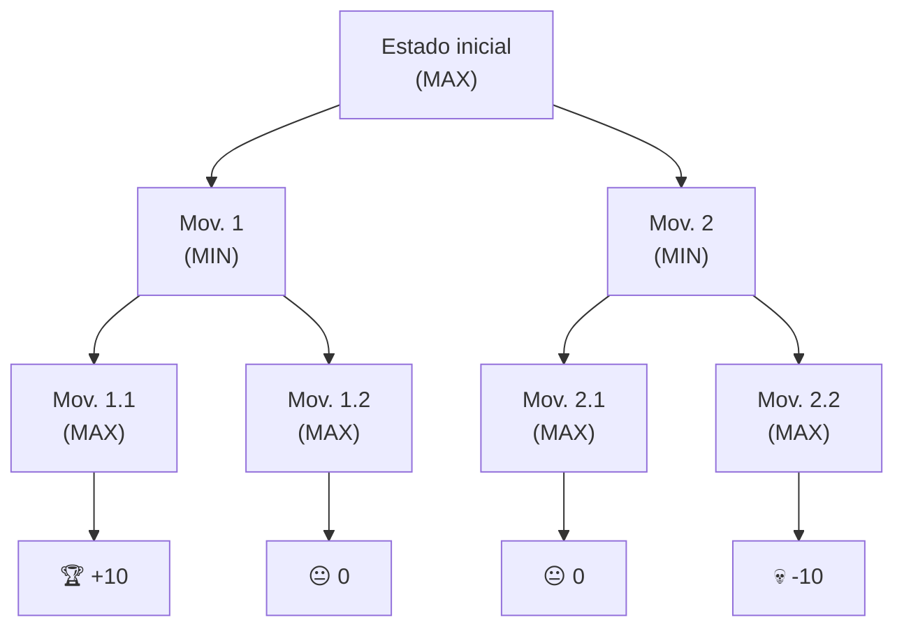
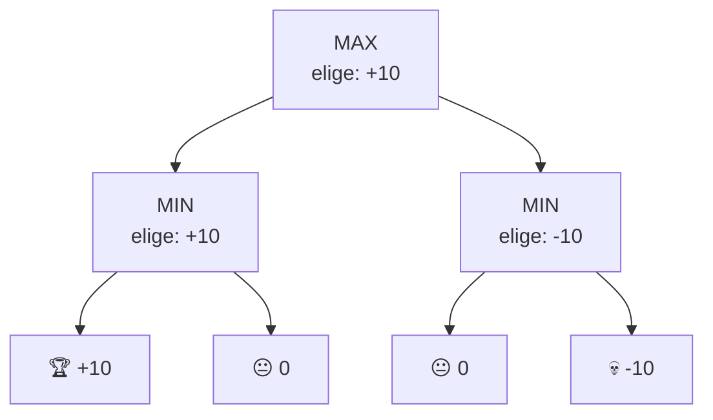
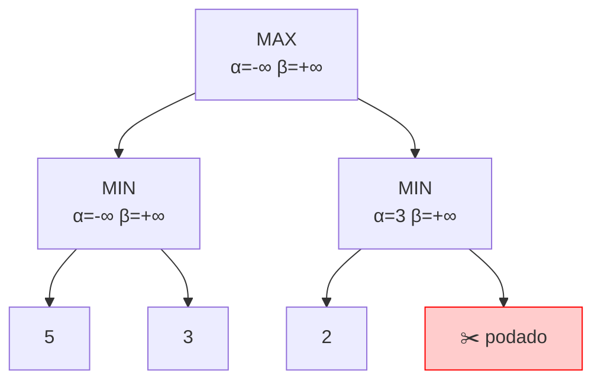

## 12. Algoritmo Minimax y Poda Alfa-Beta

---

## Índice
- [12. Algoritmo Minimax y Poda Alfa-Beta](#12-algoritmo-minimax-y-poda-alfa-beta)
- [Índice](#índice)
  - [Concepto del árbol de juego](#concepto-del-árbol-de-juego)
  - [Algoritmo Minimax](#algoritmo-minimax)
  - [Ejemplo con Tic-Tac-Toe](#ejemplo-con-tic-tac-toe)
  - [Poda Alfa-Beta](#poda-alfa-beta)
  - [Complejidad](#complejidad)

---

### Concepto del árbol de juego

Un **árbol de juego** representa todos los estados posibles de un
juego de dos jugadores. Cada nodo es un estado del tablero y cada
arista es un movimiento posible.

- **MAX** → el jugador que quiere **maximizar** su puntaje (tú)
- **MIN** → el oponente que quiere **minimizar** tu puntaje


> Las hojas del árbol tienen un **valor heurístico**: positivo si es
> bueno para MAX, negativo si es bueno para MIN.

---

### Algoritmo Minimax

Recorre el árbol completo y propaga los valores desde las hojas:
- En niveles **MAX** → elige el **máximo** de los hijos
- En niveles **MIN** → elige el **mínimo** de los hijos

**Ejemplo paso a paso:**
```
Valores en hojas: [+10, 0, 0, -10]

Nivel MAX (hojas):   +10   0     0   -10
                      │    │     │    │
Nivel MIN:          max(+10,0) min(0,-10)
                      = +10      = -10
                         │          │
Nivel MAX (raíz):    max(+10, -10)
                        = +10  ← MAX elige este movimiento
```

```cpp
int minimax(Nodo* estado, bool esMax) {
    if (estado->esHoja())
        return estado->valor;

    if (esMax) {
        int mejor = INT_MIN;
        for (Nodo* hijo : estado->hijos)
            mejor = max(mejor, minimax(hijo, false));
        return mejor;
    } else {
        int mejor = INT_MAX;
        for (Nodo* hijo : estado->hijos)
            mejor = min(mejor, minimax(hijo, true));
        return mejor;
    }
}
```

---

### Ejemplo con Tic-Tac-Toe

Estado del tablero con X a punto de ganar o perder:
```
 X | O | X
-----------
 O | X | O
-----------
   |   |   ← quedan 3 movimientos posibles
```

Función de evaluación de hoja:
- `+10` si X gana
- `-10` si O gana
- `0` empate
```cpp
int evaluar(char tablero[3][3]) {
    // revisar filas, columnas y diagonales
    for (int i = 0; i < 3; i++) {
        if (tablero[i][0] == tablero[i][1] &&
            tablero[i][1] == tablero[i][2]) {
            if (tablero[i][0] == 'X') return +10;
            if (tablero[i][0] == 'O') return -10;
        }
    }
    return 0;   // empate o juego no terminado
}
```

---

### Poda Alfa-Beta

Minimax explora **todo** el árbol — costoso para juegos grandes.
La **poda alfa-beta** elimina ramas que nunca serán elegidas,
sin afectar el resultado final.

- **α (alfa)** → mejor valor que MAX puede garantizarse hasta ahora
- **β (beta)** → mejor valor que MIN puede garantizarse hasta ahora
- Se poda cuando `α ≥ β` — esa rama no cambiará la decisión

**Ejemplo visual — mismos valores que antes:**
```
Árbol completo (Minimax):        Con poda Alfa-Beta:

MAX        ?                     MAX        ?
          / \                              / \
MIN      ?   ?          →        MIN      ?   ?
        /\ /\                           /\    ✂️
       5  3 2  9                       5  3   (no se evalúa)

MIN elige min(5,3) = 3           α = 3 después de rama izquierda
MIN elige min(2,9) = 2           En rama derecha: primer hijo = 2
MAX elige max(3,2) = 3           2 ≤ α=3 → se poda el resto ✂️
```

```cpp
int alfabeta(Nodo* estado, int alfa, int beta, bool esMax) {
    if (estado->esHoja())
        return estado->valor;

    if (esMax) {
        int mejor = INT_MIN;
        for (Nodo* hijo : estado->hijos) {
            mejor = max(mejor, alfabeta(hijo, alfa, beta, false));
            alfa  = max(alfa, mejor);
            if (alfa >= beta) break;   // poda ✂️
        }
        return mejor;
    } else {
        int mejor = INT_MAX;
        for (Nodo* hijo : estado->hijos) {
            mejor = min(mejor, alfabeta(hijo, alfa, beta, true));
            beta  = min(beta, mejor);
            if (alfa >= beta) break;   // poda ✂️
        }
        return mejor;
    }
}

// Llamada inicial
int resultado = alfabeta(raiz, INT_MIN, INT_MAX, true);
```

---

### Complejidad

| | Minimax | Alfa-Beta |
|---|---|---|
| Tiempo peor caso | O(b^d) | O(b^d) |
| Tiempo mejor caso | O(b^d) | O(b^(d/2)) |
| Espacio | O(b·d) | O(b·d) |

> `b` = factor de ramificación (movimientos posibles por estado)  
> `d` = profundidad del árbol  
> En el mejor caso, Alfa-Beta puede explorar el **doble de profundidad**
> que Minimax con el mismo costo.